# Dice Game

## Contract Address
- Sepolia: 0xc816dc97edc16aac8fa1626aaddb6d7532ed2ddc
- Version: 0.1.0

## Requisites
- Truffle
- Ganache

## Installation
1. Clone the repository
2. Start Ganache
3. Run `truffle compile`
4. Run `truffle migrate`

## Usage
```
truffle console
let instance = await DiceGame.deployed()
let accounts = await web3.eth.getAccounts()
instance.deposit({from: accounts[0], value: web3.utils.toWei("1", "ether")})
instance.startGame({from: accounts[0]})
instance.joinGame({from: accounts[1], value: web3.utils.toWei("0.1", "ether")})
instance.joinGame({from: accounts[2], value: web3.utils.toWei("0.1", "ether")})
instance.joinGame({from: accounts[3], value: web3.utils.toWei("0.1", "ether")})
await web3.eth.getBalance(instance.address)
instance.endGame()
instance.getPlayers()
await web3.eth.getBalance(instance.address)
```

## Test in Browser

1. `cd web`
2. `npm install solc fs`
3. `node .\compile.js` to create DiceGame.json
4. run test.html


## UML Diagram

```mermail
graph TD
    A[Start] -->|Deploy Contract| B[Contract Created]
    B --> C[Dealer Deposit Funds]
    C --> D{Is the Balance >= 1 Ether?}
    D -->|Yes| E[Start Game]
    D -->|No| C
    E -->|Set Game Parameters| G[Join Game Period]
    G --> H{Does a Player Join?}
    H -->|Yes| Z1{Is Bet Size Valid?}
    Z1 -->|Yes, 0 < Bet <= 0.1 Ether| K[Record Player Data]
    Z1 -->|No| H
    K -->|Are More Players Joining?| H
    K -->|No More Players| L[Proceed to Next Phase]
    L --> M{Is Join Game Period Over?}
    M -->|Yes| N[End Game]
    N --> O[Dealer Rolls Dice]
    O --> P{Check the Dealer's Score}
    P -->|Score is 3, BG| Q[Dealer Pays All Players]
    P -->|Score is 255, 一色| R[All Players Lose Bet]
    P -->|Another Score| S[Players Roll Dice]
    S --> T{Compare Scores}
    T -->|Player Score > Dealer Score| U[Player Wins, Double Bet]
    T -->|Player Score = Dealer Score| V[Player Keeps Bet]
    T -->|Player Score < Dealer Score| W[Player Loses Bet]
    U --> X[Calculate Payouts]
    V --> X[Calculate Payouts]
    W --> X[Calculate Payouts]
    Q --> Y[Finalize Payout and Charge Dealer Fee]
    R --> Y[Finalize Payout and Charge Dealer Fee]
    X --> Y[Finalize Payout and Charge Dealer Fee]
    Y --> Z[Game Ended]
    Z --> A1[Reset Game]
    A1 --> D
    M -->|No| L
    B --> C1[Dealer Sets Fee]
    C1 --> C
```